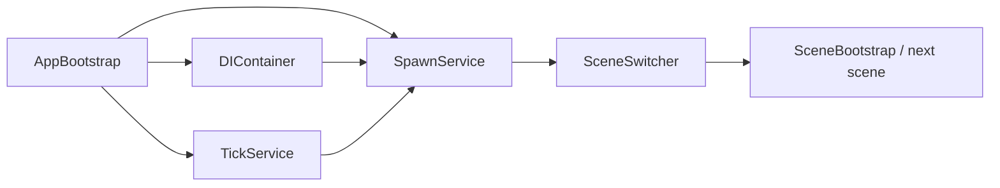

# Architecture

`AppBootstrap` is the composition root. It creates `DIContainer`, discovers registrations, constructs `TickService` and `SpawnService`, registers the services, and starts processing `SceneObject` instances. `SceneSwitcher` uses spawning and a load screen to move to the next scene. Refer to the generated [API Reference](api-reference.md) for public signatures.

## Core/LifeCycle

`SpawnService` owns lifecycle transitions and pooling. Components can implement construction, spawn, despawn, and destruction interfaces; scene roots are opt-in through `SceneObject`.

## Core/TickSystem

`TickService` queues registrations and processes system, gameplay, UI, and presentation tick layers. Gameplay uses a target tick rate; other layers follow the frame update policy.

## DI

`DIContainer` scans assemblies for registration metadata, resolves contracts, and injects marked members. Application services are registered at bootstrap rather than manually looked up from gameplay code.

## EventSystem

`EventBus` provides typed event registration, unregistration, and invocation. Event consumers own the lifetime of their subscriptions.

## DevConsole

The developer console discovers command methods through reflection, provides command completion/execution, and displays logs through the `DevConsole` prefab.
