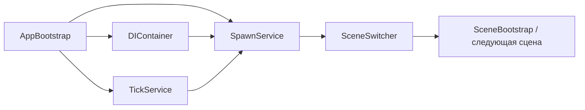

# Архитектура

`AppBootstrap` — корень композиции. Он создаёт `DIContainer`, обнаруживает регистрации, конструирует `TickService` и `SpawnService`, регистрирует сервисы и начинает обработку экземпляров `SceneObject`. `SceneSwitcher` использует спавнинг и экран загрузки для перехода к следующей сцене. Публичные сигнатуры описаны в общей [справке API](api-reference.md), доступной на английском языке.

## Core/LifeCycle

`SpawnService` управляет переходами жизненного цикла и пулами. Компоненты могут реализовывать интерфейсы конструирования, спавнинга, деспавнинга и уничтожения; корневые объекты сцены подключаются через `SceneObject`.

## Core/TickSystem

`TickService` ставит регистрации в очередь и обрабатывает системный, игровой, UI- и презентационный слои тиков. Для геймплея используется целевая частота тиков, остальные слои следуют политике обновления кадра.

## DI

`DIContainer` сканирует сборки на метаданные регистрации, разрешает контракты и внедряет отмеченные члены. Сервисы приложения регистрируются при bootstrap, а не ищутся вручную из игрового кода.

## EventSystem

`EventBus` предоставляет типизированную регистрацию, отмену регистрации и вызов событий. Потребители событий отвечают за время жизни своих подписок.

## DevConsole

Консоль разработчика находит методы команд через reflection, предлагает дополнение и выполнение команд и отображает журналы через prefab `DevConsole`.
